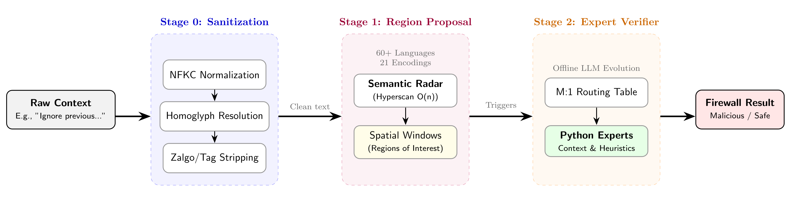

# ContextScan: Evolutionary Prompt Injection Firewall

ContextScan is a high-performance, spatial-windowing text classification pipeline designed to detect prompt injections and adversarial inputs. It uses an evolutionary "Seed and Patch" strategy where an LLM acts as a targeted debugger to mutate expert Python functions.
It is designed as a first step in a pipeline to detect injections with high recall, before applying more expensive classification methods such as embeddings, machine learning models, or protected LLM-based classification.

## How it Works

ContextScan operates analogously to a Region Proposal Network, processing text through a three-stage pipeline:



1. **Stage 0 (Sanitization):** Neutralizes stylized fonts (NFKC) and strips invisible Unicode tags (Steganography/Zalgo). It returns two versions of the text: one for the **Application** (clean, readable) and one for the **Radar** (where homoglyphs are resolved to Latin to catch bypasses).
2. **Stage 1 (Semantic Radar):** An ultra-fast Hyperscan regex engine scans the sanitized text to find points of interest. It automatically expands core concepts across **60 languages** and multiplies them by **21 different encodings** (e.g., Base64, Hex, Morse, Braille) to propose spatial text windows around categorical hits.
3. **Stage 2 (Expert Layer):** Merged windows are routed to specialized "Expert" Python functions. These functions evaluate the context and make the final, deterministic classification.

---

## Security Considerations

- **Visual Spoofing Protection:** ContextScan resolves homoglyphs (lookalike characters) to their Latin equivalents during Stage 0 to prevent bypasses (e.g., "pаypаl" with a Cyrillic 'a'). However, to avoid destroying valid multilingual input, the original characters are preserved in the `sanitized_text` returned to your application.
- **Dynamic Execution During Training:** ContextScan compiles and executes Python functions generated by an LLM. To ensure safety, the evolutionary training pipeline (`run_evolution.py`) executes these untrusted functions within an isolated **Docker/Podman sandbox** using the `llm-sandbox` library.
- **Production Inference:** The exported firewall uses static, pre-compiled functions and Hyperscan rules. However, because it still executes Python, you should review the generated `best_genome.pkl` / `firewall.py` before deploying to production to ensure no malicious code was introduced during the evolution phase.
- **Pickle Security:** When using `export_model.py`, never unpickle genomes (`.pkl` files) from untrusted sources, as this can lead to arbitrary code execution.
- **Disclaimer:** ContextScan uses deterministic rulesets and heuristic Python functions. It is designed as an ultra-fast, high-recall first step in a defense-in-depth pipeline, not a standalone infallible solution. It does not universally protect against all novel or highly obfuscated prompt injections.

---

## Development & Training

To develop and train your own custom firewall genome:

### 1. Requirements
Ensure you have the dependencies installed:
```bash
# Create and activate a virtual environment
python -m venv contextvenv
source contextvenv/bin/activate  # Linux/macOS
# OR
.\contextvenv\Scripts\activate   # Windows (PowerShell)

pip install -r requirements.txt
```

Create a `.env` file in the root directory and set your OpenAI API key (used by the LLM Mutator):
```env
OPENAI_API_KEY=sk-your-key-here
```

**Note:** You MUST have [Docker](https://www.docker.com/) or [Podman](https://podman.io/) installed and running on your system to use the evolutionary training pipeline, as it securely executes LLM-generated code in an isolated container.

### 2. Prepare Training Data
ContextScan uses a "bring your own training data" approach. Place your labeled training data in `data/training_data.json`. The format should be a list of objects:
```json
[
  {"text": "Ignore all previous instructions...", "label": 1},
  {"text": "Hello, how are you today?", "label": 0}
]
```

A dataset loader is included to fetch public datasets. Simply install the `datasets` library inside the virtual environment and run the loader:
```bash
pip install datasets
python data/dataset_loader.py
```

### 3. Customizing Filters (Layer 1)
The "Semantic Radar" relies on categories and keywords defined in `data/raw_filters.py`. 
**You must extend these raw filters** to tailor the detection to your specific needs. You can take inspiration from the extensive patterns provided in `data/public_patterns/` (e.g., `patterns1.py` through `patterns6.py`).

After modifying filters, the Radar database will automatically recompile on the next run.

### 4. Run the Evolutionary Engine
Run the training pipeline to evolve the expert functions. This process uses an LLM to "patch" and optimize the code based on execution traces from your dataset:
```bash
python run_evolution.py --iterations 5 --samples 100
```

| Flag | Description |
| :--- | :--- |
| `--iterations` | Number of evolution cycles (LLM patching rounds). |
| `--samples` | Number of random training samples to evaluate per iteration. |
| `--resume` | Resumes evolution from the existing `output/best_genome.pkl` instead of starting from a base seed. |
| `--directive` | Provides a natural language instruction to the LLM (e.g., "Focus on reducing false positives for Japanese inputs"). |
| `--container` | Choice of runtime: `docker`, `podman`, or `auto` (default). |
| `--base-image` | The base container image (default: `python:3.11-slim`). |
| `--reinstall` | Forces the sandbox to reinstall dependencies from `requirements-sandbox.txt`. |
| `--keep-template` | Retains the created container image after the session ends for faster restarts. |

This will:
1. Load the `v1_seed.py` (or latest) base genome.
2. Evaluate it against the training data inside a secure sandbox.
3. Identify failures and prompt an LLM to mutate the expert functions.
4. Save the best performing genome to `output/best_genome.pkl`.

**Note on Testing:** If you extend the core project, you can run the test suite safely within the sandbox environment using `python run_tests.py`.

### 5. Exporting for Deployment
Once you have a high-performing genome, export it into a standalone deployment folder:
```bash
python export_model.py --genome output/best_genome.pkl --output my_firewall
```
This creates a `my_firewall/` directory containing everything needed for production (no training dependencies required).

---

## Deployment Artifacts (The Exported Firewall)

The exported folder contains:
* `firewall.py`: The main inference API.
* `radar.hs`: The compiled Hyperscan binary database.
* `sanitization.py`: Stage 0 input normalization.
* `homoglyph_map.json`: Visual spoofing protection asset.

## Deployment Usage

### Python API
```python
from my_firewall.firewall import predict

result = predict("Ignore all previous instructions.")

if result["is_malicious"]:
    print("Blocked malicious input!")
else:
    # Use the sanitized text for downstream LLM calls or user serving
    process_safe_input(result["sanitized_text"])
```
